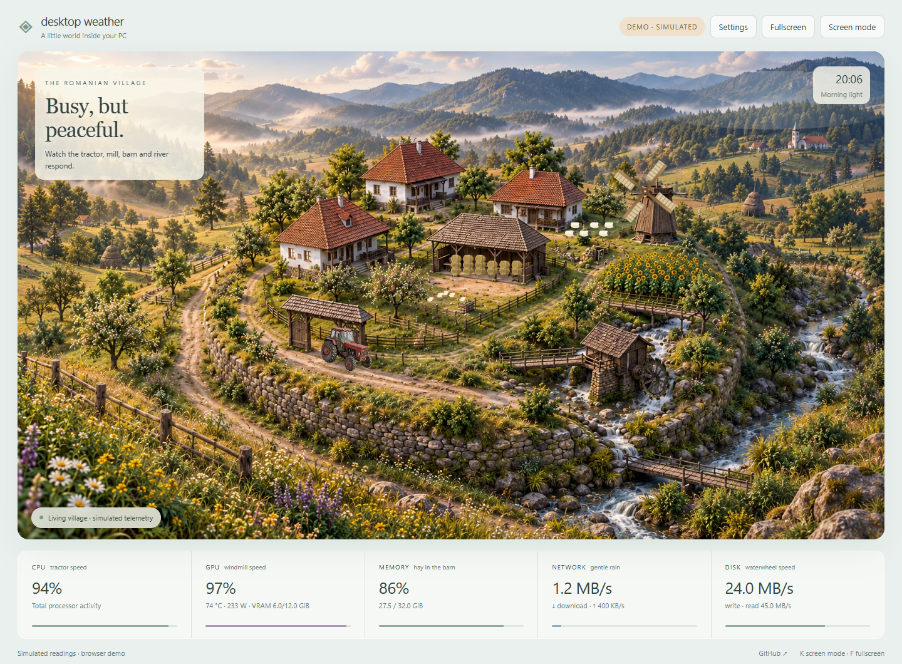

# Desktop Weather

**Turn your PC sensor screen into a living miniature world.**

A lively circular Romanian village that responds to CPU, GPU, memory, network and disk activity. Built for the small screen inside your case, the extra display on your desk, or a browser tab you leave open.



[Try the browser demo](https://samoxis.github.io/desktop-weather/?demo=idle) · [Telemetry explained](docs/telemetry.md) · [Research & decisions](docs/research.md) · [Contribute a scene](CONTRIBUTING.md)

> **v0.2 is an early, working prototype:** an illustrated background with animated layers, not an explorable 3D city. Browser demos use clearly labeled simulated values. Live readings require the local companion.

## What moves?

| Your computer | The little world |
|---|---|
| CPU utilization | Tractor speed, acceleration, wheel-face rotation and dust on the village road |
| GPU utilization | Wooden windmill rotation |
| Memory utilization | Hay bales fill the barn courtyard |
| Download + upload rate | Gentle rain, with a configurable scale |
| Disk read + write rate | Wooden waterwheel rotation synchronized with flowing river texture and foam |

Birds, grazing sheep and wandering chickens add ambient life; these are decorative and do not represent sensors. Tractor and wheel motion stop at zero or unavailable load.

The tractor follows a smooth road curve and brakes before changing direction. The river animation is mapped to the visible water channels, leaving bridges and banks intact. Both are layered 2D effects, not a physical vehicle or fluid simulation.

Morning, golden-hour and moonlight appearances are selectable. Day and night use matching cinematic Romanian countryside artwork; the exterior is filled with hills, fields, forest and a stream. Automatic lighting follows your local clock, without location lookup. Usage drives the scene; **it is not a temperature gauge or thermal alarm**. The GPU temperature is shown separately.

## Run locally

Requires **Node.js 22 or newer**. No npm packages, account, API key or administrator permission needed.

```sh
git clone https://github.com/samoxis/desktop-weather.git
cd desktop-weather
node server.mjs
```

Open **http://127.0.0.1:4783**. On Windows you can also double-click `Start-Desktop-Weather.cmd` from the downloaded project folder.

Move the browser onto the sensor screen. Use **F11** for the browser's fullscreen mode, then **K** to hide app controls. Press **K** again or use the faint exit button to restore them. The app's Fullscreen button is also available where supported.

- **Settings → Data source** switches between live readings and four simulated scenarios.
- **Settings → Animation** offers Eco (15 FPS cap), Balanced (30 FPS cap) and Still.
- **Settings → GPU** selects an NVIDIA GPU on multi-GPU systems.
- **Settings → Show readings in screen mode** lets you keep only the village.
- **Settings → Rain at** calibrates the visual response to your connection speed. This is an animation scale, not a measurement of your connection's maximum speed.
- `http://127.0.0.1:4783/?screen=1` opens directly in screen mode.

The app pauses polling and drawing when its tab is hidden and respects reduced-motion preferences. Startup at Windows login, a native monitor picker and a packaged `.exe` are planned; this version does not configure them.

## Telemetry support

| Metric | Windows | Other operating systems |
|---|---|---|
| CPU utilization, used/total RAM | Yes, Node.js OS APIs | Available via OS APIs; not hardware-tested here |
| Upload/download, disk read/write | Windows CIM raw counters | Not implemented yet |
| NVIDIA GPU load, temperature, VRAM, power, fan percentage | Existing `nvidia-smi`, where supported | Collector can use existing `nvidia-smi`; not hardware-tested here |
| AMD / Intel GPU sensors | Not implemented yet | Not implemented yet |
| CPU temperature, coolant, pumps, motherboard fans | Not implemented yet | Not implemented yet |

Missing, warming-up and unsupported sensors show **—**, not a made-up zero. GPU fan percentage can legitimately be zero when fans are stopped. It is not fan RPM.

The GPU collector does **not** install NVIDIA drivers or change HWiNFO settings. Disable it with:

```sh
node server.mjs --no-gpu
```

Network defaults to the busiest measured adapter, rather than adding physical and virtual adapters together. This avoids naive double-counting but is not total traffic across all interfaces. Pin an exact CIM adapter name with `DW_INTERFACE`; see [telemetry details](docs/telemetry.md).

## Display compatibility

Any screen recognized as a monitor by the OS can show the browser: HDMI, DisplayPort or a USB graphics display. Layouts were checked at 800×480, 480×800 and 1920×480, as well as regular desktop and small mobile widths. This is browser-layout validation, not a physical screen test.

USB-only smart screens with proprietary protocols and cooler/AIO LCDs are **not supported in v0.2**. They need device-specific adapters. The full circular scene stays visible at all aspect ratios; portrait and ultrawide screens use a softened landscape extension around the illustration. Dedicated compositions remain on the roadmap.

## Local by design

The companion listens only on `127.0.0.1`. It sends readings only to your local browser, rejects foreign hosts/origins and serves only the `public/` directory. No analytics, cloud telemetry, process names, IP addresses, serial numbers or persistent sensor history. The static demo works without a companion and reads no hardware. GitHub links are ordinary links you can choose to open.

Preferences are stored in the browser. Sensor readings are not. This release does not create scheduled tasks, modify startup entries, change fan curves or write system configuration.

## Development

```sh
node scripts/check.mjs
node --test
```

No dependency installation or build step. `public/` is also the complete static demo. GitHub Actions checks JavaScript and tests on Windows and Linux; a separate Pages workflow publishes the demo.

## Next places to take it

- Purpose-built compact, portrait and ultrawide scenes instead of cropping one illustration.
- Read-only LibreHardwareMonitor adapter with explicit sensor mapping and source freshness.
- AMD/Intel GPU support with hardware-backed validation.
- Native monitor selection and an optional desktop wrapper.
- Scene packs with normalized anchors, preview thumbnails and community contributions.
- Measured renderer/collector resource budgets on small PCs.
- Carefully selected adapters for USB smart screens.

## Credits & license

Code is MIT licensed. The village background was created for this project using OpenAI image generation; it is AI-generated artwork, not a live 3D render. The included artwork is offered under the same MIT terms. No third-party project code or artwork was copied. Research references and the related projects are listed in [research notes](docs/research.md).
