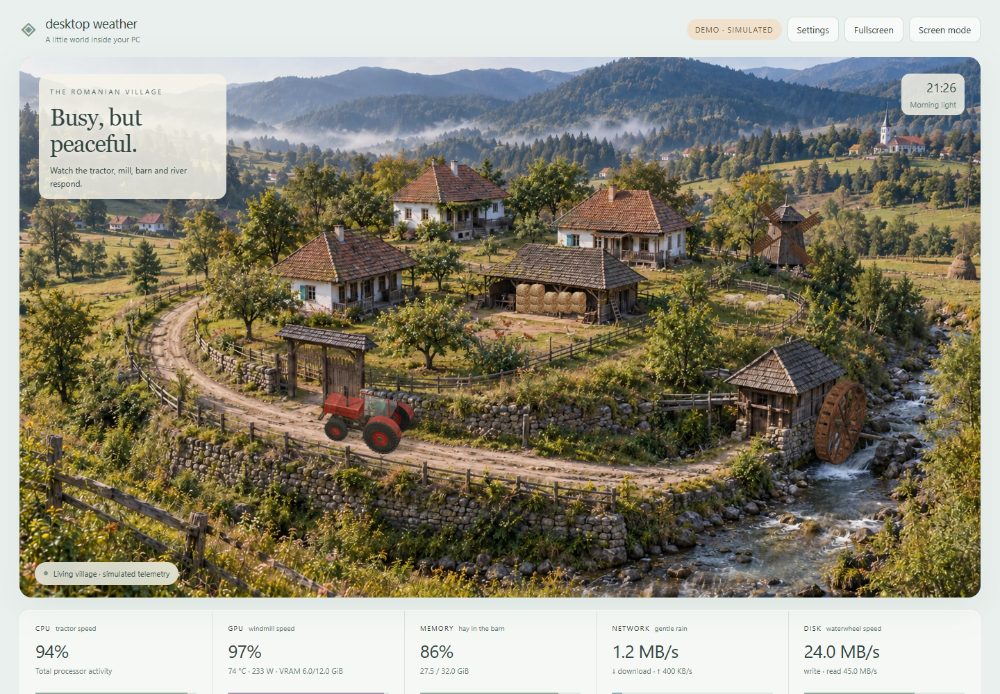

# Desktop Weather

**A Romanian countryside that moves with your PC.**

A lively circular Romanian village that responds to CPU, GPU, memory, network and disk activity. Built for the small screen inside your case, the extra display on your desk, or a browser tab you leave open.



[Try the browser demo](https://samoxis.github.io/desktop-weather/?demo=idle) · [Telemetry explained](docs/telemetry.md) · [Research & decisions](docs/research.md) · [Contribute a scene](CONTRIBUTING.md)

The default scene now uses the [approved photographic direction](docs/approved-direction.md). Its unchanged original remains available in a separate [static art-review view](https://samoxis.github.io/desktop-weather/?view=art-review&demo=render).

> **v0.5 combines a photographic background with independently animated 3D machinery.** A fixed camera preserves the village's detailed buildings, vegetation and surrounding landscape. Tractor tires and steering, both mills, masked water, droplets and photographic animal poses move separately. This is a 2.5D composite, not an explorable 3D village. Browser demos use clearly labeled simulated values; live readings require the local companion.

## What moves?

| Your computer | The little world |
|---|---|
| CPU utilization | Tractor speed, acceleration, four rotating tires and steering on a continuous village road |
| GPU utilization | Wooden windmill rotation |
| Memory utilization | Photographic hay bales fill the barn |
| Download + upload rate | Small depth-scaled droplets, ground splashes, wet rings and a softer overcast appearance, with a configurable scale |
| Disk read + write rate | A wooden waterwheel on a fixed 3D axle, synchronized with motion inside the photographed river channels |

Photographic hen walking/pecking poses, grazing sheep and swallow wing poses add ambient life. They are decorative; birds and night fireflies become more visible during GPU activity. Sensor-driven machinery stops at zero or unavailable load.

The tractor follows a closed route, turns with the road tangent and steers its front wheels. Tire rotation integrates traveled distance divided by each tire's effective radius, accounting for its apparent scale in the background. Tread, rims and hubs rotate together. Photographic foreground masks hide it behind trees and buildings on the far circuit. The wheel's rims, spokes and paddles rotate around one shared shaft. River highlights and machinery use a shared flow rate; this is an artistic telemetry mapping rather than a fluid or vehicle physics simulation.

Morning, golden-hour and moonlight appearances are selectable. Aligned day/night photographic plates crossfade with matching machinery lighting and warm windows. Hills, trees, fields and a stream fill the surroundings. Automatic lighting follows your local clock, without location lookup. Usage drives the scene; **it is not a temperature gauge or thermal alarm**. The GPU temperature is shown separately.

## Run locally

Requires **Node.js 22 or newer**, plus a browser with **WebGL 2 and hardware acceleration**. No npm installation, account, API key or administrator permission needed. Three.js is bundled locally.

```sh
git clone https://github.com/samoxis/desktop-weather.git
cd desktop-weather
node server.mjs
```

Open **http://127.0.0.1:4783**. On Windows you can also double-click `Start-Desktop-Weather.cmd` from the downloaded project folder.

Move the browser onto the sensor screen. Use **F11** for the browser's fullscreen mode, then **K** to hide app controls. Press **K** again or use the faint exit button to restore them. The app's Fullscreen button is also available where supported.

- **Settings → Data source** switches between live readings and four simulated scenarios.
- **Settings → Animation** offers Smooth (60 FPS cap, default), Eco (30 FPS cap with lower resolution), Balanced (30 FPS cap) and Still.
- **Settings → GPU** selects an NVIDIA GPU on multi-GPU systems.
- **Settings → Show readings in screen mode** lets you keep only the village.
- **Settings → Rain at** calibrates the visual response to your connection speed. This is an animation scale, not a measurement of your connection's maximum speed.
- `http://127.0.0.1:4783/?screen=1` opens directly in screen mode.

The app pauses polling and drawing when its tab is hidden and respects reduced-motion preferences. Startup at Windows login, a native monitor picker and a packaged `.exe` are planned; this version does not configure them.

## Telemetry support

| Metric | Windows | Other operating systems |
|---|---|---|
| CPU utilization, used/total RAM | Yes, Node.js OS APIs | Available via OS APIs; not hardware-tested here |
| Upload/download, disk read/write | Windows CIM raw counters | Not implemented yet |
| NVIDIA GPU load, temperature, VRAM, power, fan percentage | Existing `nvidia-smi`, where supported | Collector can use existing `nvidia-smi`; not hardware-tested here |
| AMD / Intel GPU sensors | Not implemented yet | Not implemented yet |
| CPU temperature, coolant, pumps, motherboard fans | Not implemented yet | Not implemented yet |

Missing, warming-up and unsupported sensors show **—**, not a made-up zero. GPU fan percentage can legitimately be zero when fans are stopped. It is not fan RPM.

The GPU collector does **not** install NVIDIA drivers or change HWiNFO settings. Disable it with:

```sh
node server.mjs --no-gpu
```

Network defaults to the busiest measured adapter, rather than adding physical and virtual adapters together. This avoids naive double-counting but is not total traffic across all interfaces. Pin an exact CIM adapter name with `DW_INTERFACE`; see [telemetry details](docs/telemetry.md).

## Display compatibility

Any screen recognized as a monitor by the OS can show the browser: HDMI, DisplayPort or a USB graphics display. Layouts were checked at 800×480, 480×800 and 1920×480, as well as regular desktop and small mobile widths. This is browser-layout validation, not a physical screen test.

USB-only smart screens with proprietary protocols and cooler/AIO LCDs are **not supported in v0.5**. They need device-specific adapters. The full village stays visible in portrait and ultrawide layouts, with a softened photographic exterior filling the remaining space. Dedicated compositions remain on the roadmap.

The compositor and machinery renderer consume CPU/GPU resources themselves. Smooth caps drawing at 60 FPS; Eco lowers the machinery resolution and display pixel ratio. These are targets, not performance guarantees. Resource budgets on low-power PCs still need measurement.

## Local by design

The companion listens only on `127.0.0.1`. It sends readings only to your local browser, rejects foreign hosts/origins and serves only the `public/` directory. No analytics, cloud telemetry, process names, IP addresses, serial numbers or persistent sensor history. The static demo works without a companion and reads no hardware. GitHub links are ordinary links you can choose to open.

Preferences are stored in the browser. Sensor readings are not. This release does not create scheduled tasks, modify startup entries, change fan curves or write system configuration.

## Development

```sh
node scripts/check.mjs
node --test
```

No dependency installation or build step. `public/` is also the complete static demo, including pinned Three.js 0.186.1. GitHub Actions checks JavaScript and tests on Windows and Linux; a separate Pages workflow publishes the demo. See [validation](docs/validation.md) for what was actually exercised.

## Next places to take it

- Purpose-built compact, portrait and ultrawide compositions.
- Read-only LibreHardwareMonitor adapter with explicit sensor mapping and source freshness.
- AMD/Intel GPU support with hardware-backed validation.
- Native monitor selection and an optional desktop wrapper.
- Higher-detail art and scene packs with preview thumbnails and community contributions.
- Measured renderer/collector resource budgets on small PCs.
- Carefully selected adapters for USB smart screens.

## Credits & license

Project code and generated project artwork are offered under MIT terms. Three.js, BufferGeometryUtils and HDRLoader are bundled under their [MIT license](public/vendor/THREE-LICENSE.txt), copyright the Three.js authors. The photographic plates, material atlas and life sprites were created with OpenAI image generation; machinery models and animation are code-generated. Lighting uses Sergej Majboroda's CC0 [Rural Landscape HDRI](https://polyhaven.com/a/rural_landscape). Earlier experimental renderers/assets remain in Git history and retained source, but are not loaded by the default app. See [art provenance](docs/art-direction.md) and [research notes](docs/research.md).

